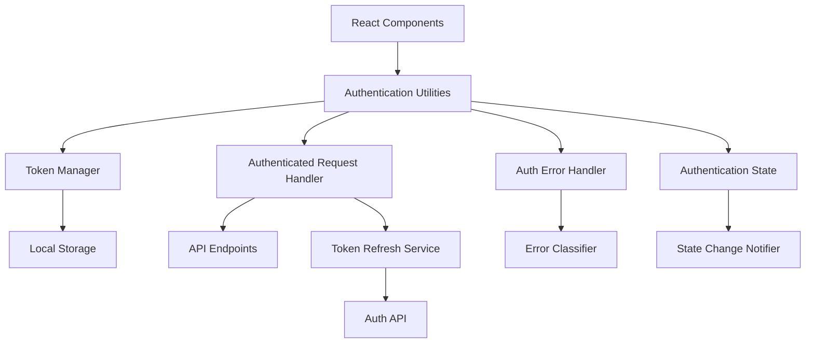
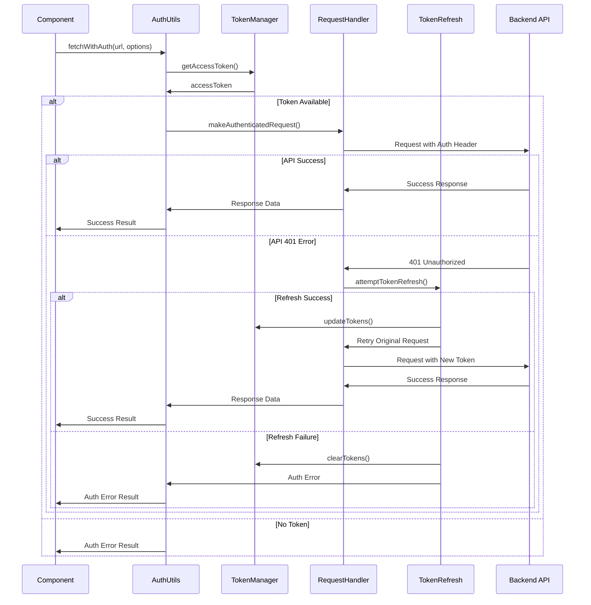

# Authentication Utilities Design

## Overview

The Authentication Utilities system provides a comprehensive set of functions and utilities for handling authentication in the frontend application. It centralizes authentication logic, token management, and error handling to ensure consistent behavior across all components. The system integrates seamlessly with the existing API structure while providing the missing `fetchWithAuth` function and other authentication utilities.

## Architecture

### High-Level Architecture



### Component Interaction Flow



## Components and Interfaces

### 1. Authentication Utilities (Main Interface)

**Purpose**: Primary interface for all authentication-related operations

**Interface**:
```javascript
// Main authentication utility functions
export const fetchWithAuth = async (url, options = {}) => APIResponse
export const login = async (credentials) => AuthResult
export const logout = () => void
export const refreshTokens = async () => RefreshResult
export const isAuthenticated = () => boolean
export const getAuthState = () => AuthState
export const onAuthStateChange = (callback) => UnsubscribeFunction
```

### 2. Token Manager

**Purpose**: Handles all token storage, retrieval, and validation operations

**Interface**:
```javascript
class TokenManager {
  getAccessToken(): string | null
  getRefreshToken(): string | null
  setTokens(accessToken: string, refreshToken: string): void
  clearTokens(): void
  isTokenValid(token: string): boolean
  isTokenExpired(token: string): boolean
  getTokenPayload(token: string): object | null
}
```

### 3. Authenticated Request Handler

**Purpose**: Manages HTTP requests with authentication headers and retry logic

**Interface**:
```javascript
class AuthenticatedRequestHandler {
  async makeRequest(url: string, options: RequestOptions): Promise<APIResponse>
  addAuthHeaders(options: RequestOptions): RequestOptions
  handleAuthError(error: Error, originalRequest: RequestOptions): Promise<APIResponse>
  retryWithNewToken(url: string, options: RequestOptions): Promise<APIResponse>
}
```

### 4. Token Refresh Service

**Purpose**: Handles automatic token refresh when access tokens expire

**Interface**:
```javascript
class TokenRefreshService {
  async refreshAccessToken(): Promise<RefreshResult>
  isRefreshInProgress(): boolean
  queueRequest(requestPromise: Promise): Promise
  clearRefreshQueue(): void
}
```

### 5. Authentication State Manager

**Purpose**: Manages global authentication state and notifies components of changes

**Interface**:
```javascript
class AuthStateManager {
  getCurrentState(): AuthState
  updateState(newState: Partial<AuthState>): void
  subscribe(callback: StateChangeCallback): UnsubscribeFunction
  unsubscribe(callback: StateChangeCallback): void
  notifyStateChange(): void
}
```

## Data Models

### API Response Model
```javascript
interface APIResponse {
  success: boolean
  data?: any
  error?: string
  errorType?: 'auth' | 'network' | 'server' | 'client' | 'validation'
  statusCode?: number
  fromAPI: boolean
  metadata?: {
    url: string
    method: string
    timestamp: Date
    retryAttempt?: number
  }
}
```

### Authentication Result Model
```javascript
interface AuthResult {
  success: boolean
  user?: UserProfile
  tokens?: {
    accessToken: string
    refreshToken: string
    expiresIn: number
  }
  error?: string
  errorType?: 'credentials' | 'network' | 'server'
}
```

### Authentication State Model
```javascript
interface AuthState {
  isAuthenticated: boolean
  user: UserProfile | null
  tokens: {
    accessToken: string | null
    refreshToken: string | null
    expiresAt: Date | null
  }
  lastAuthCheck: Date
  authInProgress: boolean
}
```

### Token Refresh Result Model
```javascript
interface RefreshResult {
  success: boolean
  newTokens?: {
    accessToken: string
    refreshToken: string
    expiresIn: number
  }
  error?: string
  shouldLogout: boolean
}
```

### Request Options Model
```javascript
interface RequestOptions {
  method?: 'GET' | 'POST' | 'PUT' | 'DELETE' | 'PATCH'
  headers?: Record<string, string>
  body?: string | FormData
  credentials?: 'include' | 'same-origin' | 'omit'
  signal?: AbortSignal
  timeout?: number
}
```

## Correctness Properties

*A property is a characteristic or behavior that should hold true across all valid executions of a system-essentially, a formal statement about what the system should do. Properties serve as the bridge between human-readable specifications and machine-verifiable correctness guarantees.*

Before writing the correctness properties, let me analyze the acceptance criteria for testability:

<function_calls>
<invoke name="prework">
<parameter name="featureName">auth-utilities

Property 1: Authorization header inclusion
*For any* valid access token and API endpoint, calling fetchWithAuth should include the access token in the Authorization header
**Validates: Requirements 1.1**

Property 2: No-token authentication error
*For any* API endpoint, calling fetchWithAuth without an access token should return an authentication error without making network calls
**Validates: Requirements 1.2**

Property 3: Successful response structure
*For any* successful API response, fetchWithAuth should return response data with success indicators and proper metadata
**Validates: Requirements 1.3**

Property 4: Error classification consistency
*For any* API failure, fetchWithAuth should return error information with appropriate error type classification
**Validates: Requirements 1.4**

Property 5: Refresh token header inclusion
*For any* request with available refresh token, fetchWithAuth should include the refresh token in request headers
**Validates: Requirements 1.5**

Property 6: Automatic refresh on 401
*For any* API call returning 401 unauthorized with available refresh token, the system should attempt token refresh
**Validates: Requirements 2.1**

Property 7: Retry after successful refresh
*For any* successful token refresh, the system should retry the original request with the new access token
**Validates: Requirements 2.2**

Property 8: Token cleanup on refresh failure
*For any* failed token refresh attempt, the system should clear all stored tokens and return authentication error
**Validates: Requirements 2.3**

Property 9: Skip refresh without token
*For any* 401 error without available refresh token, the system should skip refresh attempts and return authentication error
**Validates: Requirements 2.4**

Property 10: Token storage after refresh
*For any* successful token refresh, the system should update stored access token for future requests
**Validates: Requirements 2.5**

Property 11: Standardized error objects
*For any* authentication failure, the system should return error objects with consistent structure including error type and message
**Validates: Requirements 3.1**

Property 12: Error type distinction
*For any* network or authentication error, the system should correctly distinguish and classify the error type
**Validates: Requirements 3.2**

Property 13: Error information preservation
*For any* server error, the system should preserve original error information while indicating proper error type
**Validates: Requirements 3.3**

Property 14: Validation error handling
*For any* validation error, the system should return client error classification with detailed error information
**Validates: Requirements 3.4**

Property 15: Token parsing error handling
*For any* malformed token, the system should return authentication error with appropriate error message
**Validates: Requirements 3.5**

Property 16: Token storage completeness
*For any* token storage operation, both access and refresh tokens should be saved to localStorage
**Validates: Requirements 4.1**

Property 17: Token retrieval consistency
*For any* stored tokens, retrieval should return the same access and refresh token values
**Validates: Requirements 4.2**

Property 18: Complete token clearing
*For any* token clearing operation, all authentication data should be removed from localStorage
**Validates: Requirements 4.3**

Property 19: Token validation accuracy
*For any* token, validation should correctly verify format and expiration status
**Validates: Requirements 4.4**

Property 20: Token replacement behavior
*For any* token update operation, new values should replace existing tokens in storage
**Validates: Requirements 4.5**

Property 21: Authentication status accuracy
*For any* authentication state, status checks should return whether the user is currently authenticated
**Validates: Requirements 5.1**

Property 22: State change notification
*For any* authentication state change, subscribed components should be notified of the change
**Validates: Requirements 5.2**

Property 23: Logout cleanup completeness
*For any* logout operation, all authentication state and tokens should be cleared
**Validates: Requirements 5.3**

Property 24: Login state establishment
*For any* successful login, authentication state should be established with provided tokens
**Validates: Requirements 5.4**

Property 25: Expiration state handling
*For any* token expiration, authentication state should be updated to reflect expired status
**Validates: Requirements 5.5**

## Error Handling

### Error Classification System

The system categorizes errors into specific types for appropriate handling:

1. **Authentication Errors**: Invalid tokens, expired sessions, missing credentials
2. **Network Errors**: Connection timeouts, DNS failures, network unavailability  
3. **Server Errors**: 5xx HTTP status codes, internal server errors
4. **Client Errors**: 4xx HTTP status codes (except 401), validation failures
5. **Validation Errors**: Malformed requests, invalid parameters

### Error Response Structure

```javascript
const errorResponse = {
  success: false,
  error: "Human-readable error message",
  errorType: "auth" | "network" | "server" | "client" | "validation",
  statusCode: 401, // HTTP status code if applicable
  originalError: {
    message: "Original error message",
    stack: "Error stack trace (development only)"
  },
  metadata: {
    url: "https://api.example.com/endpoint",
    method: "POST",
    timestamp: new Date(),
    retryAttempt: 1
  }
}
```

### Retry Logic

```javascript
const retryConfig = {
  auth: {
    maxRetries: 1, // Only retry once after token refresh
    retryDelay: 0, // Immediate retry after refresh
    shouldRetry: (error) => error.statusCode === 401 && hasRefreshToken()
  },
  network: {
    maxRetries: 3,
    retryDelay: [1000, 2000, 4000], // Exponential backoff
    shouldRetry: (error) => error.errorType === 'network'
  },
  server: {
    maxRetries: 2,
    retryDelay: [2000, 5000],
    shouldRetry: (error) => error.statusCode >= 500
  }
}
```

## Testing Strategy

### Unit Testing Approach

The system will use **Jest** as the primary testing framework for unit tests. Unit tests will focus on:

- Individual utility function behavior (fetchWithAuth, login, logout, etc.)
- Token management operations (storage, retrieval, validation, clearing)
- Error handling for specific scenarios (network failures, auth failures, etc.)
- State management operations (authentication state updates, notifications)
- Request header construction and validation

Unit tests will verify specific examples and edge cases:
- Valid and invalid token formats
- Different HTTP status codes and error responses
- localStorage operations and data persistence
- Authentication state transitions
- Error message formatting and classification

### Property-Based Testing Approach

The system will use **fast-check** for property-based testing to verify universal properties across all inputs. Property-based tests will be configured to run a minimum of 100 iterations each.

Property-based tests will verify:
- Authentication header behavior across different tokens and endpoints
- Error classification consistency across various error types
- Token storage and retrieval operations across different token formats
- State management behavior across different authentication states
- Request retry logic across different failure scenarios

Each property-based test will be tagged with a comment explicitly referencing the correctness property from this design document using the format: **Feature: auth-utilities, Property {number}: {property_text}**

### Integration Testing

Integration tests will verify:
- End-to-end authentication workflows (login, authenticated requests, logout)
- Token refresh flows with real API interactions
- Error handling integration with UI components
- State synchronization across multiple components

### Testing Configuration

```javascript
// Jest configuration for authentication utilities testing
module.exports = {
  testEnvironment: 'jsdom',
  setupFilesAfterEnv: ['<rootDir>/src/test/auth-setup.js'],
  testMatch: [
    '**/__tests__/**/*.test.js',
    '**/__tests__/**/*.property.test.js'
  ],
  collectCoverageFrom: [
    'src/utils/auth/**/*.js',
    'src/services/auth/**/*.js'
  ],
  moduleNameMapping: {
    '^@/(.*)$': '<rootDir>/src/$1'
  }
}
```

The testing strategy ensures comprehensive coverage through both concrete examples (unit tests) and universal property verification (property-based tests), providing confidence in the authentication system's reliability across all possible scenarios.