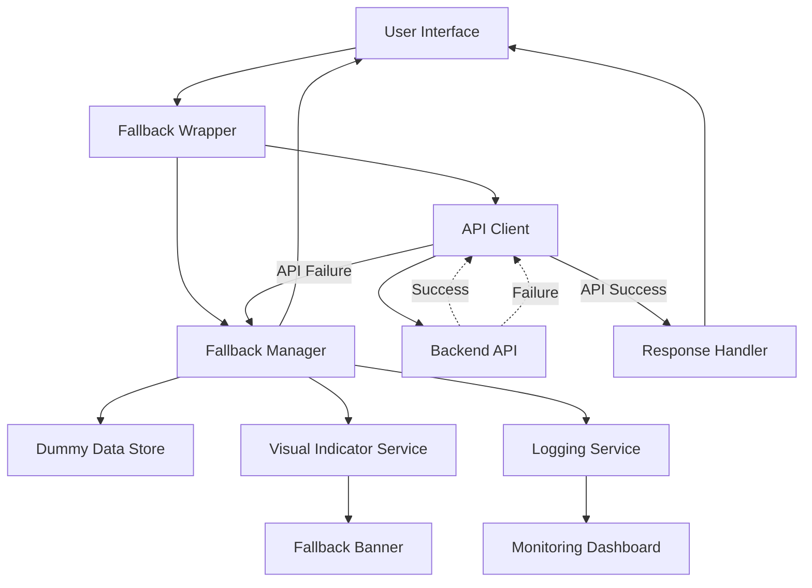
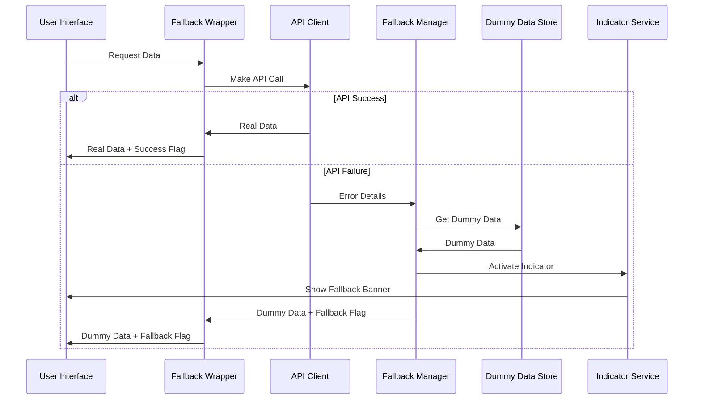

# Backend Fallback System Design

## Overview

The Backend Fallback System is a comprehensive solution that ensures application continuity when backend APIs fail. It provides a seamless user experience by automatically serving dummy data when real API calls fail, while clearly indicating to users when they are viewing demonstration data rather than real information.

The system builds upon the existing `apiWithFallback.js` implementation but enhances it with better error handling, visual indicators, monitoring capabilities, and a more robust architecture.

## Architecture

### High-Level Architecture



### Component Interaction Flow



## Components and Interfaces

### 1. Fallback Wrapper Service

**Purpose**: Central orchestrator that manages API calls and fallback logic

**Interface**:
```javascript
class FallbackWrapperService {
  async makeRequest(endpoint, options, fallbackConfig)
  registerFallbackData(endpoint, dummyDataGenerator)
  setGlobalFallbackMode(enabled)
  getSystemStatus()
}
```

**Key Methods**:
- `makeRequest()`: Executes API calls with automatic fallback
- `registerFallbackData()`: Associates dummy data with specific endpoints
- `setGlobalFallbackMode()`: Enables/disables fallback system globally
- `getSystemStatus()`: Returns current system health and fallback status

### 2. Fallback Manager

**Purpose**: Handles fallback logic, dummy data retrieval, and state management

**Interface**:
```javascript
class FallbackManager {
  async getFallbackData(endpoint, requestParams)
  activateFallbackMode(endpoint, errorDetails)
  deactivateFallbackMode(endpoint)
  isInFallbackMode(endpoint)
  getFallbackMetrics()
}
```

### 3. Visual Indicator Service

**Purpose**: Manages UI indicators that show when dummy data is active

**Interface**:
```javascript
class VisualIndicatorService {
  showFallbackBanner(message, type)
  hideFallbackBanner()
  markElementAsDummy(element, metadata)
  clearDummyMarkers()
  updateGlobalIndicator(status)
}
```

### 4. Dummy Data Store

**Purpose**: Centralized repository for all dummy data with smart generation

**Interface**:
```javascript
class DummyDataStore {
  getDummyData(endpoint, params)
  registerDummyDataGenerator(endpoint, generator)
  updateDummyData(endpoint, newData)
  validateDataStructure(endpoint, data)
}
```

### 5. Logging and Monitoring Service

**Purpose**: Tracks fallback usage, errors, and system performance

**Interface**:
```javascript
class LoggingService {
  logFallbackActivation(endpoint, error, timestamp)
  logFallbackDeactivation(endpoint, timestamp)
  logAPIRecovery(endpoint, timestamp)
  getUsageMetrics(timeRange)
  exportLogs(format)
}
```

## Data Models

### API Response Model
```javascript
interface APIResponse {
  success: boolean
  data: any
  fromAPI: boolean
  fallbackUsed?: boolean
  error?: string
  errorType?: 'network' | 'auth' | 'notfound' | 'server' | 'validation'
  originalError?: {
    message: string
    type: string
    timestamp: Date
  }
  metadata?: {
    endpoint: string
    requestId: string
    responseTime: number
  }
}
```

### Fallback Configuration Model
```javascript
interface FallbackConfig {
  endpoint: string
  dummyDataGenerator: Function
  retryAttempts: number
  retryDelay: number
  cacheTimeout: number
  indicatorConfig: {
    showBanner: boolean
    bannerMessage: string
    elementStyling: object
  }
}
```

### System Status Model
```javascript
interface SystemStatus {
  globalFallbackEnabled: boolean
  endpointStatuses: Map<string, EndpointStatus>
  totalRequests: number
  fallbackRequests: number
  lastHealthCheck: Date
}

interface EndpointStatus {
  endpoint: string
  isInFallbackMode: boolean
  lastSuccessfulCall: Date
  lastFailedCall: Date
  consecutiveFailures: number
  fallbackActivatedAt?: Date
}
```

## Correctness Properties

*A property is a characteristic or behavior that should hold true across all valid executions of a system-essentially, a formal statement about what the system should do. Properties serve as the bridge between human-readable specifications and machine-verifiable correctness guarantees.*

<function_calls>
<invoke name="prework">
<parameter name="featureName">backend-fallback-system

Property 1: API failure triggers dummy data
*For any* API endpoint and any type of failure, when the API call fails, the system should return appropriate dummy data for that endpoint
**Validates: Requirements 1.1**

Property 2: Visual indicators accompany dummy data
*For any* instance where dummy data is displayed, the system should show clear visual indicators that the data is not real
**Validates: Requirements 1.2**

Property 3: Backend recovery restores real data
*For any* endpoint in fallback mode, when the backend becomes available again, the system should automatically switch back to real data
**Validates: Requirements 1.3**

Property 4: Dummy data structure consistency
*For any* dummy data response, the data structure should match the corresponding real API response structure
**Validates: Requirements 1.4**

Property 5: Independent endpoint handling
*For any* set of API endpoints, failures in one endpoint should not affect the operation of other endpoints
**Validates: Requirements 1.5**

Property 6: Shopkeeper dummy data completeness
*For any* shopkeeper dashboard request that fails, the system should provide dummy data including orders, menu items, and analytics
**Validates: Requirements 2.1**

Property 7: Shopkeeper demonstration notices
*For any* shopkeeper interface displaying dummy data, the system should show prominent notices indicating demonstration data
**Validates: Requirements 2.2**

Property 8: Realistic dummy orders
*For any* dummy order data, the orders should have realistic statuses and customer information
**Validates: Requirements 2.3**

Property 9: Analytics dummy data provision
*For any* analytics request that fails, the system should provide sample charts and metrics data
**Validates: Requirements 2.4**

Property 10: Menu diversity in dummy data
*For any* menu request that fails, the dummy data should show a variety of food categories and items
**Validates: Requirements 2.5**

Property 11: Wrapper function handles failures
*For any* API call made through the wrapper function, both success and failure cases should be handled correctly
**Validates: Requirements 3.1**

Property 12: Easy endpoint registration
*For any* new endpoint, the system should allow easy registration of dummy data for that endpoint
**Validates: Requirements 3.2**

Property 13: Fallback activation logging
*For any* fallback activation, the system should log the failed endpoint and error details
**Validates: Requirements 3.4**

Property 14: Global fallback configuration
*For any* global enable/disable action, the fallback mode should affect all endpoints consistently
**Validates: Requirements 3.5**

Property 15: Persistent fallback banner
*For any* active dummy data state, the system should display a persistent banner indicating dummy mode
**Validates: Requirements 4.1**

Property 16: Distinct dummy styling
*For any* dummy content display, the system should use distinct visual styling to differentiate from real data
**Validates: Requirements 4.2**

Property 17: Safe dummy sensitive data
*For any* dummy data containing sensitive information, the system should use obviously fake but realistic placeholder values
**Validates: Requirements 4.3**

Property 18: Disabled destructive actions
*For any* dummy mode activation, actions that would modify real data should be disabled
**Validates: Requirements 4.5**

Property 19: Fallback activation logging with details
*For any* fallback mode activation, the system should log the failed endpoint and error details
**Validates: Requirements 5.1**

Property 20: Usage metrics tracking
*For any* dummy data served, the system should track usage metrics for each endpoint
**Validates: Requirements 5.2**

Property 21: Recovery event logging
*For any* backend connectivity restoration, the system should log the recovery event
**Validates: Requirements 5.3**

Property 22: Error pattern aggregation
*For any* multiple failures, the system should aggregate error patterns for analysis
**Validates: Requirements 5.4**

Property 23: Performance metrics provision
*For any* system monitoring request, the system should provide metrics on fallback frequency and duration
**Validates: Requirements 5.5**

## Error Handling

### Error Classification System

The system categorizes errors into specific types for appropriate handling:

1. **Network Errors**: Connection timeouts, DNS failures, network unavailability
2. **Authentication Errors**: Invalid tokens, expired sessions, unauthorized access
3. **Server Errors**: 5xx HTTP status codes, internal server errors
4. **Client Errors**: 4xx HTTP status codes, validation failures
5. **Data Errors**: Malformed responses, schema mismatches

### Error Recovery Strategies

```javascript
const errorRecoveryStrategies = {
  network: {
    retryAttempts: 3,
    retryDelay: [1000, 2000, 4000], // Exponential backoff
    fallbackAfter: 3,
    healthCheckInterval: 30000
  },
  authentication: {
    retryAttempts: 1,
    refreshToken: true,
    fallbackAfter: 1,
    redirectToLogin: true
  },
  server: {
    retryAttempts: 2,
    retryDelay: [2000, 5000],
    fallbackAfter: 2,
    healthCheckInterval: 60000
  },
  client: {
    retryAttempts: 0,
    fallbackAfter: 0,
    logError: true
  }
}
```

### Graceful Degradation Levels

1. **Level 1 - Retry**: Automatic retry with exponential backoff
2. **Level 2 - Cached Data**: Serve previously cached successful responses
3. **Level 3 - Dummy Data**: Serve contextually appropriate dummy data
4. **Level 4 - Minimal UI**: Show basic interface with error message

## Testing Strategy

### Unit Testing Approach

The system will use **Jest** as the primary testing framework for unit tests. Unit tests will focus on:

- Individual component functionality (FallbackManager, VisualIndicatorService, etc.)
- Error handling logic for different error types
- Dummy data generation and validation
- Configuration management
- Logging functionality

Unit tests will verify specific examples and edge cases:
- Network timeout scenarios
- Authentication failure handling
- Malformed API responses
- Configuration validation
- Cache management

### Property-Based Testing Approach

The system will use **fast-check** for property-based testing to verify universal properties across all inputs. Property-based tests will be configured to run a minimum of 100 iterations each.

Property-based tests will verify:
- API wrapper behavior across different endpoints and error conditions
- Dummy data structure consistency with real API schemas
- Visual indicator behavior across different UI states
- Logging completeness across various error scenarios
- Recovery behavior across different failure patterns

Each property-based test will be tagged with a comment explicitly referencing the correctness property from this design document using the format: **Feature: backend-fallback-system, Property {number}: {property_text}**

### Integration Testing

Integration tests will verify:
- End-to-end fallback workflows
- UI component integration with fallback system
- Real API integration and fallback triggers
- Cross-component communication

### Testing Configuration

```javascript
// Jest configuration for property-based testing
module.exports = {
  testEnvironment: 'jsdom',
  setupFilesAfterEnv: ['<rootDir>/src/test/setup.js'],
  testMatch: [
    '**/__tests__/**/*.test.js',
    '**/__tests__/**/*.property.test.js'
  ],
  collectCoverageFrom: [
    'src/services/fallback/**/*.js',
    'src/utils/apiWithFallback.js'
  ]
}
```

The testing strategy ensures comprehensive coverage through both concrete examples (unit tests) and universal property verification (property-based tests), providing confidence in the system's reliability across all possible scenarios.